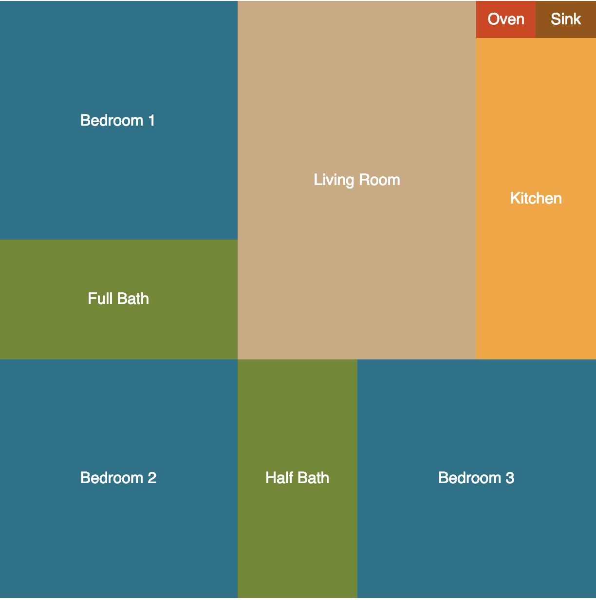

# Floor Plan Lab

#### Intro

In the Intro to JSX lesson, you saw the following React basics:

- How to define components as functions
- How to return a function component's UI defined using JSX
- How to pass props to components
- How to access the properties on props within a component

The minimum requirements below are a deliverable, not a suggestion, so make sure your app satisfies every one of them before you consider the lab done.

#### Setup

1. Clone this repo and `cd` into it.
2. Run `npm create vite@latest . -- --template react-ts` to scaffold the project into the current directory. If prompted about the directory not being empty, choose to keep your existing files.
3. Run `npm install` to install the project's dependencies.
4. Run `npm run dev` to start the dev server.

#### Minimum Requirements

Define each component in its own file. The naming convention to use for a component's file is UpperCamelCase, so a `<CodeSandbox>` component's file would be named `CodeSandbox.tsx`.

Define the following components as functions and code them so they fulfill their responsibilities:

| Component | Responsibilities |
| --------- | ----------------- |
| `<FloorPlan>` | Rendered by `<App>`. Renders the following components: a `<Kitchen>` component, a `<LivingRoom>` component, three `<Bedroom>` components, and two `<Bath>` components. Render the components in any order you wish to make the floor plan more interesting. |
| `<Kitchen>` | Renders the text "Kitchen" and the following components: an `<Oven>` component and a `<Sink>` component. |
| `<LivingRoom>` | Renders the text "Living Room". |
| `<Bedroom>` | Accepts a `bedNum` prop and renders the text "Bedroom [bedNum]", substituting the value of the `bedNum` prop. |
| `<Bath>` | Accepts a `size` prop and renders the text "[size] Bath", for example "Half Bath" or "Full Bath". |
| `<Oven>` | Renders the text "Oven". |
| `<Sink>` | Renders the text "Sink". |

Style the components to make the output look like a floor plan. Use CSS Modules for the styling rather than a single global stylesheet, so each component's styles stay scoped to that component.

#### Solution

A full solution lives in the solution branch. Try to complete the lab on your own first, don't peek before you've given it a real attempt.